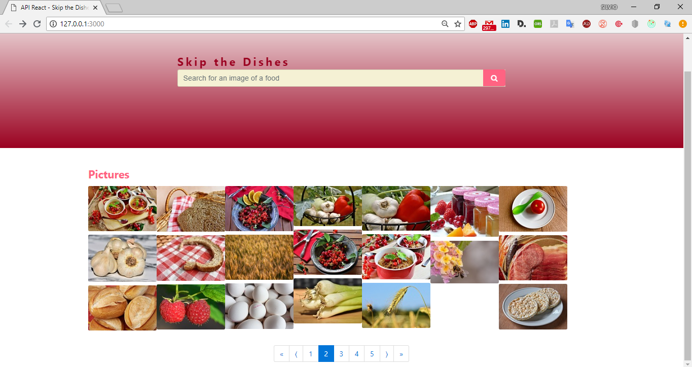
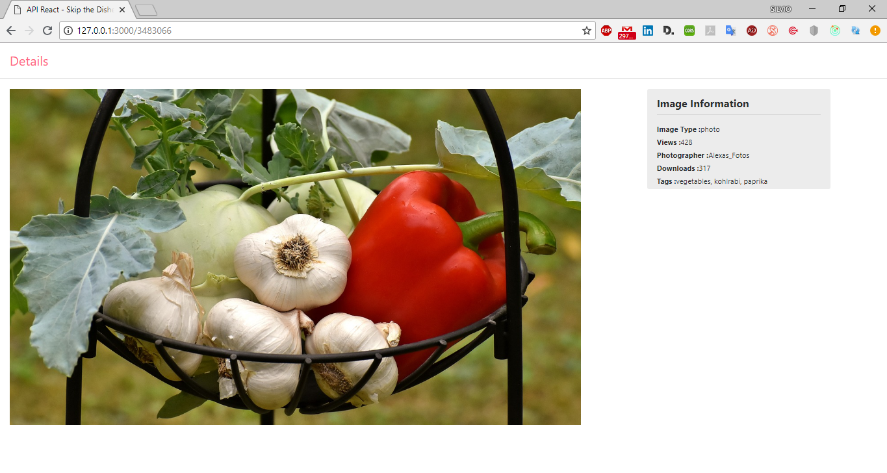

## VanHack
##SkipTheDishes - Skip the Dishes

## API
This application will use Pixabay API (http://www.pixabay.com) to fetch images of food.
It is rendered in the page. The UI of this page consist of a grid layout.
The content is visible correctly both in desktop and smartphones and pagination system for the content of the page.
A second page is implemented. This consist of a detailed view of one of the
pictures. In this one, a bigger version of the image, the name of the photographer, tags,
views, downloads and size are displayed. 

#### Running
- In your terminal, cd into the cloned folder and run `npm install`.
- Run `npm run build`. This runs webpack and recompiles when changes are made.
- Open a second tab on the terminal and run `npm run dev` or `npm start`.

> **Note:** 
> - `npm run dev` starts webpack-dev-server and watches for file changes. File updates are  instantly seen on the browser.
> - On the other hand, `npm start` runs [server.js]. You would have to refresh your browser to see your changes.

> - To search for an image, type a name and click the search icon

# Images

# Main Technologies implemented
> - Redux = a valuable tool for organizing the state of objects,
> - Axios = Promise based HTTP client for the browser and node.js, to make a GET request
> - react-router-dom =  to make routes
